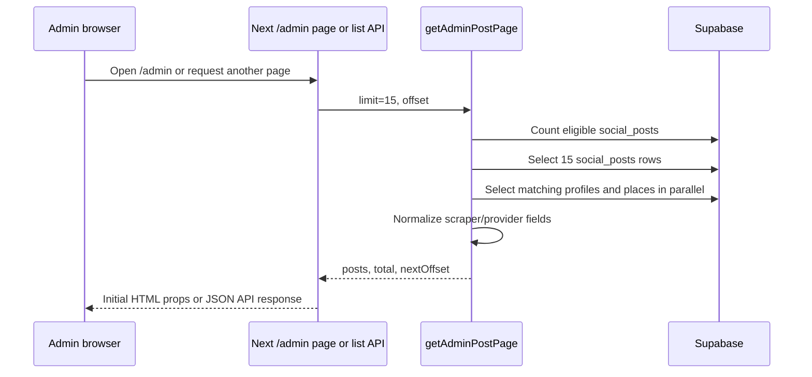
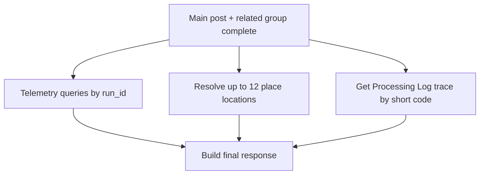
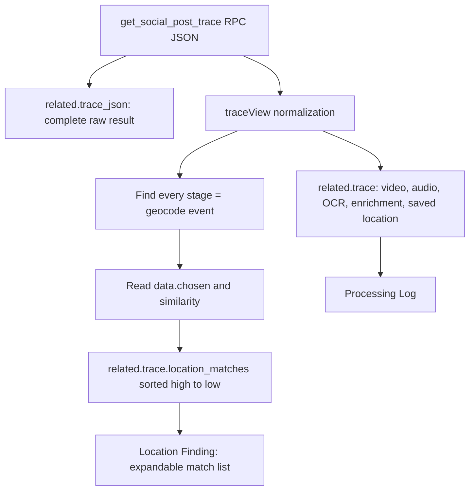
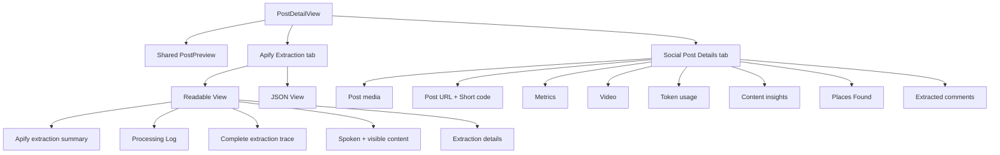

# Admin Social Posts Dashboard: Complete Flow

## Scope

This document describes the current Admin Social Posts dashboard only. It covers:

- Route and URL behavior
- Server-rendered directory loading
- Card and List view behavior
- Client-side hooks and state
- Post-detail API request and response flow
- Supabase tables, query keys, and fields used
- Processing Log, Maps, media, and external requests
- Detail tabs and the component that renders each section

It documents the existing code paths; it does not define a new API contract.

---

## 1. File map

| File | Responsibility |
| --- | --- |
| `src/app/admin/page.tsx` | Server entry for `/admin`; loads the first directory page from Supabase. |
| `src/app/admin/[postId]/page.tsx` | Server entry for `/admin/:postId`; starts the selected-post experience. |
| `src/app/admin/posts-dashboard.tsx` | Chooses between the post browser and the selected-post detail screen. |
| `src/app/admin/posts-browser.tsx` | Client dashboard for Card/List switching, search, infinite card loading, URL state, and opening a post. |
| `src/app/admin/posts-list.tsx` | Client List view: filters, sorting, row navigation, and pagination UI. |
| `src/app/admin/pagination.tsx` | Reusable numbered pagination with previous and next buttons. |
| `src/app/admin/post-detail-page.tsx` | Client post-detail loader; requests `/api/admin/posts/:id`. |
| `src/app/admin/post-detail-view.tsx` | Client tab layout for Social Post Details and Apify Extraction. |
| `src/app/admin/extracted-comments.tsx` | Collapsible Social Post Details card for normalized Apify comments. |
| `src/app/admin/apify-trace-details.tsx` | Readable, expandable rendering of the complete `get_social_post_trace` JSON result. |
| `src/app/admin/location-finding.tsx` | Processing Log Location Finding card and expandable list of every scored geocode choice. |
| `src/app/admin/post-components.tsx` | Reusable cards for places, extraction, token usage, processing log, and shared display primitives. |
| `src/app/admin/post-media-gallery.tsx` | Validates post-media URLs in the browser and shows only images that actually load. |
| `src/app/admin/place-map.tsx` | Lazily loads Leaflet and OpenStreetMap tiles for a place map. |
| `src/app/api/admin/posts/route.ts` | HTTP API for paginated directory results. |
| `src/app/api/admin/posts/[id]/route.ts` | HTTP API that builds the complete selected-post response. |
| `src/lib/admin-posts.ts` | Server-only post-list query and social-provider data normalization. |
| `src/lib/social-post-trace.ts` | Server-only Processing Log trace RPC call and trace-data normalization. |
| `src/lib/google-maps.ts` | Server-only place address/coordinate resolver. |
| `src/lib/supabase.ts` | Creates the server-side Supabase client used by the admin APIs. |

---

## 2. Routes and URL state

| URL | Page file | Meaning |
| --- | --- | --- |
| `/admin` | `src/app/admin/page.tsx` | Dashboard, Card View by default. |
| `/admin?view=list` | `src/app/admin/page.tsx` | Dashboard, List View page 1. |
| `/admin?view=list&page=2` | `src/app/admin/page.tsx` | Dashboard, List View page 2. |
| `/admin/:postId?view=list&page=2` | `src/app/admin/[postId]/page.tsx` | Post detail. The query preserves the source dashboard view/page for Back navigation. |

### URL flow

```mermaid
flowchart LR
  A[Admin opens /admin] --> B[admin/page.tsx]
  B --> C[getAdminPostPage limit 15]
  C --> D[AdminPostsDashboard]
  D --> E[PostsBrowser]

  E -->|Card View| F[/admin?view=cards]
  E -->|List View page 2| G[/admin?view=list&page=2]
  E -->|Open post| H[/admin/:postId with current query]
  H --> I[admin/[postId]/page.tsx]
  I --> J[PostDetailPage]
  J -->|Back button| E
```

### Why the selected view survives opening a post

`PostsBrowser.openPost()` reads the active view and list page, then appends them to the selected post URL. `PostDetailPage` reads those query parameters and uses them to build the Back URL. This is why returning from a detail page restores List View/page or Card View.

---

## 3. Dashboard directory loading

### 3.1 Initial server request

`src/app/admin/page.tsx` is a server component. It is configured as dynamic:

```ts
export const dynamic = 'force-dynamic';
export const revalidate = 0;
```

For the requested List page, it calls:

```ts
getAdminPostPage({
  limit: 15,
  offset: (initialListPage - 1) * 15,
});
```

The result is passed as props to `AdminPostsDashboard`, then to `PostsBrowser`.

### 3.2 Directory API requests after the first render

`PostsBrowser` uses the lightweight list API:

```text
GET /api/admin/posts?offset={offset}&limit=15
```

`src/app/api/admin/posts/route.ts` parses `offset` and `limit`, calls `getAdminPostPage`, and returns:

```ts
{
  success: true,
  posts: AdminPostSummary[],
  total: number,
  nextOffset: number | null
}
```

### 3.3 Directory data flow



### 3.4 Directory database queries

`getAdminPostPage()` in `src/lib/admin-posts.ts` performs these reads.

| Table | Query/key | Fields selected or used | Purpose |
| --- | --- | --- | --- |
| `social_posts` | Count where `content_id` is null or does not contain `pending` | `id` for count | Total eligible post count. |
| `social_posts` | Same eligibility filter, ordered by `created_at DESC`, ranged by `offset`/`limit` | `id`, `user_id`, `place_id`, `platform`, `content_type`, `content_id`, `author_username`, `caption`, `display_url`, `post_url`, `likes`, `views`, `comments`, `primary_category`, `short_code`, `status`, `created_at`, `raw_apify_data` | The 15 summary rows shown in Cards/List. |
| `profiles` | `id IN (userIds)` | `id`, `display_name`, `phone` | User name and phone shown in List view. |
| `places` | `id IN (placeIds)` | `id`, `name`, `address`, `neighborhood`, `city` | Main place name/address shown in List view. |

### 3.5 Data normalization

`normalizeAdminPost()` converts different provider payload shapes into one dashboard shape. It reads the normal columns above and may also read nested values from `social_posts.raw_apify_data`, such as:

- Caption: `caption`, `raw.caption`, `raw.text`, `raw.description`
- Post URL: `post_url`, `raw.url`, `raw.webVideoUrl`, `raw.inputUrl`
- Video URL: `video_url`, `raw.videoUrl`, `raw.webVideoUrl`, `raw.videoMeta.videoUrl`, `raw.videoMeta.playUrl`
- Media: image/carousel/provider URL fields found recursively in the raw payload
- Metrics: normal columns plus raw Apify values such as `likesCount`, `videoViewCount`, `commentsCount`, `shareCount`, and `collectCount`
- Creator, music, hashtags, mentions, categories, content insights, transcript, and OCR text

The browser receives the normalized display data, not a direct Supabase client connection.

---

## 4. Card View and List View behavior

### Card View

- The first 15 posts come from server props.
- `PostsBrowser` keeps loaded cards in `loadedPosts`.
- An `IntersectionObserver` watches a sentinel near the bottom of the grid.
- When the sentinel is near the viewport, it calls `/api/admin/posts?offset={nextOffset}&limit=15`.
- The API result is appended after duplicate IDs are removed.
- A card (`PostThumbnail`) tries the next supplied image URL if its current image fails to load.

### List View

- The current List page contains 15 posts.
- `PostsList` filters only the rows currently loaded for that page.
- It provides client-side filters for platform, content type, location, and global search.
- It provides client-side sorting by creator, location, created date, likes, or views.
- A row opens the post detail when clicked or when Enter/Space is pressed.
- The Post URL cell stops event propagation so its external link opens instead of navigating to detail.
- `Pagination` shows previous/next buttons and numbered pages, using ellipses when there are many pages.
- The count next to the view buttons is cumulative: `min(currentPage * 15, total) / total posts`.

---

## 5. Client hooks and state

All files marked `"use client"` execute in the browser. Server route/page files do not use React client hooks.

| File/component | Hook/state | What it does |
| --- | --- | --- |
| `PostsBrowser` | `useSearchParams`, `usePathname`, `useRouter` | Reads/writes `view` and `page` in the URL and opens a selected post. |
| `PostsBrowser` | `useState(search)` | Holds dashboard search text. |
| `PostsBrowser` | `useState(loadedPosts, nextOffset, cardsReady, isLoadingMore)` | Holds Card View loading state and infinite-scroll data. |
| `PostsBrowser` | `useState(listPosts, listPage, listLoading)` | Holds the active List View page and request state. |
| `PostsBrowser` | `useState(error)` | Holds directory API errors. |
| `PostsBrowser` | `useMemo(cards)` | Filters already-loaded card rows using the search term. |
| `PostsBrowser` | `useCallback(fetchListPage/loadMorePosts)` | Keeps request functions stable for pagination and the observer. |
| `PostsBrowser` | `useRef(loadMoreSentinel)` | References the element observed for infinite Card View loading. |
| `PostsBrowser` | `useEffect(IntersectionObserver)` | Starts/disconnects the Card View infinite-scroll observer. |
| `PostThumbnail` | `useState(imageIndex)` | Switches to the next supplied thumbnail when an image URL fails. |
| `PostsList` | `useState(platform/type/location)` | Holds List-only filters. |
| `PostsList` | `useState(sort/descending)` | Holds List sorting selection and direction. |
| `PostsList` | `useMemo(filtered)` | Filters and sorts only the current 15-row list page. |
| `PostDetailPage` | `useState(detail/error/loading)` | Holds selected-post API response, error, and loading state. |
| `PostDetailPage` | `useEffect` + `AbortController` | Starts the detail fetch when `postId` changes and cancels it during cleanup/navigation. |
| `PostDetailView` | `useState(primaryTab)` | Defaults to `social`; switches Social Post Details / Apify Extraction. |
| `PostDetailView` | `useState(extractionView)` | Defaults to `readable`; switches Apify Readable View / JSON View. |
| `ExtractedComments` | `useState(expanded)` | Keeps the comments card open/closed when its header is clicked. |
| `PostMediaGallery` | `useMemo(candidates)` | Builds unique valid `http`/`https` candidate media URLs. |
| `ValidatedMediaGallery` | `useState(images)` | Holds the subset of media URLs that loaded successfully. |
| `ValidatedMediaGallery` | `useEffect` | Preloads candidates with `Image`; prevents state updates after cleanup. |
| `CopyReference` | `useState(copied)` | Shows a temporary `Copied` message after using the clipboard API. |
| `ApifyTraceDetails` | No hooks | Renders every raw trace field as readable nested cards/details elements. |
| `LocationFinding` | No hooks | Renders saved trace location data and a native expandable list of scored geocode selections. |
| `PlaceMap` | `useId` | Generates an element ID for one map instance. |
| `PlaceMap` | `useRef(mapRef)` | Keeps the Leaflet map instance for cleanup. |
| `PlaceMap` | `useEffect` | Loads Leaflet if needed, creates the map/pin, then removes it on unmount. |

### Detail-fetch cancellation

`PostDetailPage` creates an `AbortController` inside its effect and passes `controller.signal` to `fetch`. If the component unmounts or the post ID changes, cleanup calls `controller.abort()`.

In development, React Strict Mode may mount, clean up, then mount the component again. That can display one cancelled request and one successful request in the Network tab. The cancelled request is intentionally ignored by the error handler.

---

## 6. Opening a post: request flow

### Browser to Next.js

`PostDetailPage` requests exactly this endpoint for the selected post:

```text
GET /api/admin/posts/{postId}
```

The browser does not call Supabase directly for the post-detail response.

```mermaid
flowchart TD
  A[Admin clicks post card or list row] --> B[PostsBrowser.openPost]
  B --> C[/admin/:postId?view=...&page=...]
  C --> D[admin/[postId]/page.tsx]
  D --> E[PostDetailPage useEffect]
  E --> F[GET /api/admin/posts/:postId]
  F --> G[Next.js server route]
  G --> H[Supabase server client]
  H --> I[Supabase database/RPC]
  I --> G
  G --> J[Complete JSON response]
  J --> E
  E --> K[PostDetailView]
```

### Server access

`src/lib/supabase.ts` creates `supabaseAdmin` using server environment variables. It is used only by server code/API routes. The service role key is not sent to the browser.

---

## 7. Selected-post API: exact stages

File: `src/app/api/admin/posts/[id]/route.ts`

### Stage A — main post

The API first fetches the full selected post:

```text
social_posts
where id = :postId
select *
```

It returns HTTP 400 if the ID is missing, HTTP 404 if no row exists, and HTTP 500 for a main-post database error.

The row is converted with `normalizeAdminPost()` before it is returned.

### Stage B — first related-data group

After the main post exists, these reads are started together with `Promise.all`:

| Table/source | Lookup | Why it is read |
| --- | --- | --- |
| `profiles` | `id = social_posts.user_id` | Related creator profile. |
| `places` | `id = social_posts.place_id` | Primary place. |
| `places` | `social_post_id = :postId`, newest first | Legacy/direct post-to-place records. |
| `social_post_places` + `places(*)` | `social_post_id = :postId`, newest first | Many-to-many post/place links, confidence, explanation, evidence, and linked place. |
| `saved_places` | `social_post_id = :postId`, newest first | Existing saved-place records. |
| `extraction_runs` | Prefer `social_post_id = :postId`; legacy URL fallback if no direct records | Extraction runs used for details, comments, stages, calls, candidates, and logs. |
| `extraction_run_summary` | `social_post_id = :postId` | Token usage summary. |
| `extraction_stage_runs` | `social_post_id = :postId` | Per-stage token usage and stage metadata. |

#### Extraction run lookup rules

The direct relation is tried first:

```text
extraction_runs.social_post_id = selected post ID
```

If no direct extraction rows exist, legacy records are found from a token derived from the post URL. The fallback checks URL-like columns in this order:

```text
input_url → post_url → url → source_url
```

The fallback uses partial matching so older unlinked rows can still be found.

### Stage C — extraction telemetry group

After runs are available, the route collects their IDs and starts these requests together:

| Table | Lookup | Returned use |
| --- | --- | --- |
| `extraction_run_stages` | `run_id IN (runIds)`, ordered by `started_at` | Extraction pipeline stage details. |
| `extraction_run_calls` | `run_id IN (runIds)`, ordered by `created_at` | Service/model call details. |
| `extraction_candidates` | `run_id IN (runIds)`, ordered by `created_at` | Candidate places and decisions. |
| `extraction_run_logs` | `run_id IN (runIds)`, ordered by `created_at` | Aggregated/log information. |

### Stage D — independent work done concurrently

Once the first related-data group is available, the route starts three independent jobs and waits for all three together:



1. **Telemetry**: stages, calls, candidates, and logs.
2. **Locations**: up to 12 unique places are sent to `resolvePlaceLocation()`.
3. **Trace**: `getSocialPostTrace(shortCode)` loads the Processing Log data.

This concurrency does not alter response keys or UI data; it avoids waiting for one independent job before starting another.

### Stage E — final response

The API returns this shape:

```ts
{
  success: true,
  post: normalizedPost,
  related: {
    primary_place,
    direct_places,
    place_links,
    apify,
    post_reference,
    trace,
    trace_json,
    token_usage,
    extraction,
    locations,
  },
  warnings: string[]
}
```

Optional-relation errors are collected in `warnings`. That is the source of the UI message:

```text
Some optional records could not be loaded for this post.
```

The main post itself is still available when only optional relation queries fail.

---

## 8. Processing Log, coordinates, and map sources

### Processing Log trace

File: `src/lib/social-post-trace.ts`

The trace helper calls the Supabase RPC function:

```text
get_social_post_trace
```

It first supplies the current database function parameter name:

```ts
{ p_short_code: shortCode }
```

It retains legacy parameter-name fallbacks for compatibility. The RPC raw JSON is kept in `related.trace_json`. A safe display view is produced in `related.trace`.

The trace display view extracts:

| UI group | Values looked up in trace JSON |
| --- | --- |
| Video | URL, duration, width, height |
| Audio | transcript, language, duration, source/provider |
| OCR | detected text and processed frame count |
| Content enrichment | summary, primary category, secondary categories, guardrail/fine-tuning value |
| Location finding | saved place name/address/coordinates plus all scored Google Maps geocode choices |

The location finder recursively searches nested trace objects for `latitude`/`lat` and `longitude`/`lng`/`lon`; it does not invent coordinates.

### Geocode similarity records

The trace normalizer separately walks the complete RPC result and retains **every** event that has this shape:

```text
stage = "geocode"
data.chosen.similarity = numeric value
```

For each qualifying event it keeps the chosen place data and event data:

```text
name, type, match, address, similarity, sourceAddressMismatch, results,
event ID, run ID, social post ID, stage, level, Google Maps search message,
elapsed time, selected timestamp
```

These records are exposed as `related.trace.location_matches`, ordered by similarity from highest to lowest. The older `related.trace.location_match` field remains the first/highest entry for compatibility, but the Location Finding UI uses the complete `location_matches` list.

In the dashboard, **Processing Log → Location Finding** has no map. It shows the saved place/address/coordinates and an expandable **Location search matches** section. Expanding it reveals every scored geocode selection in readable cards. The maps in **Social Post Details → Places Found** are separate and remain unchanged.



### Places Found location resolution

File: `src/lib/google-maps.ts`

For each unique place (maximum 12), the API receives these place fields:

```text
id, name, address, neighborhood, city, latitude, longitude
```

The helper:

1. Uses saved latitude/longitude if present.
2. Builds a fallback address from `address`, `neighborhood`, and `city`.
3. If coordinates are missing and no `GOOGLE_MAPS_API_KEY` exists, returns the saved fallback data without an external request.
4. Otherwise calls Google Geocoding server-side using either `latlng` or an address query.
5. Returns a display address, latitude, longitude, and Google Maps URL.

The browser receives only the resolved result. It never receives the Google Maps API key.

### Display map

`Places` uses `related.locations` with place records. If both coordinates exist, it renders `PlaceMap`.

`PlaceMap` loads Leaflet from `unpkg.com` and map tiles from OpenStreetMap in the browser. This is separate from the selected-post API response and may create separate browser network requests for the JavaScript, CSS, and map tiles.

---

## 9. Detail UI: data ownership and tabs

The selected-post view is rendered by `src/app/admin/post-detail-view.tsx`.



### Shared preview

`PostPreview` is above the primary tabs, so it is visible in both tabs. It displays:

- Cover image from `post.display_url`
- Platform and content type
- Caption
- Hashtags, mentions, and first comment
- Overlay metrics: views, likes, comments, plays, shares, saves
- Creator identity information

### Social Post Details tab

| Component/section | Data source |
| --- | --- |
| Post media | `post.images`, validated by `PostMediaGallery` in the browser. |
| Post URL and Short code | `post.post_url` plus `related.post_reference`. |
| Post/reel metrics | `post.views`, `likes`, `comments`, `video_plays`, `shares`, `saves`. |
| Video | `post.video_url`. |
| Token Usage | `related.token_usage`. |
| Content insights | Normalized `post` fields: summary, categories, music, duration, format, niche, audience, tags, brands, locations, calls to action, topics. |
| Places Found | `related.primary_place`, `direct_places`, `place_links`, and `locations`. |
| Extracted Comments | `related.apify.comments`; collapsed/expanded locally by `ExtractedComments`. Each row is author → truncated comment → date/time and engagement data. The full comment is available through the native hover tooltip. |

### Apify Extraction tab — Readable View

| Component/section | Data source |
| --- | --- |
| Apify extraction summary | `related.apify`, built from `social_posts.raw_apify_data`. |
| Processing Log | `related.trace`, built by `getSocialPostTrace()`. |
| Complete extraction trace | `related.trace_json`, the complete raw JSON returned by `get_social_post_trace`, rendered as structured expandable cards by `ApifyTraceDetails`. |
| Spoken content | `post.transcript`. |
| Visible content | `post.visible_text`. |
| Extraction Details | `related.extraction`, built from extraction runs, stages, calls, candidates, and logs. |

### Apify Extraction tab — JSON View

JSON View uses `JSON.stringify(..., null, 2)` and displays this relevant extraction subset:

```ts
{
  apify: related.apify,
  trace: related.trace,
  trace_json: related.trace_json,
  extraction: related.extraction,
  spoken_content: post.transcript,
  visible_content: post.visible_text
}
```

It intentionally does not mix unrelated general Admin UI state into the extraction JSON.

---

## 10. Media behavior

### Dashboard thumbnails

- Card thumbnails use `display_url` first, then `image_urls`.
- If an image fails, the Card component tries the next candidate URL.
- List thumbnails hide an image element when it fails.

### Detail Post Media card

`PostMediaGallery` receives `post.images`, removes the already-shown primary cover image, removes duplicates, and keeps only valid `http`/`https` URLs.

It creates browser `Image` objects for every candidate. Only URLs whose `onload` event fires are included in the gallery and its count. Failed/non-backend/unloadable URLs are not displayed or counted.

These image checks are browser media requests; they are not additional `/api/admin/posts/:id` calls.

---

## 11. Error handling and missing data

| Situation | Current handling |
| --- | --- |
| Main post missing | Detail API returns 404; `PostDetailPage` shows an error card. |
| Main post query failure | Detail API returns 500; error card is shown. |
| Optional relation/table/column unavailable | API records a warning; the detail screen still renders available data. |
| No extraction runs | Extraction Details shows its existing empty state. |
| No trace | Processing Log says no trace data is available. |
| Trace has no scored geocode event | Location Finding keeps its saved location fields and the expandable match list shows its no-records state. |
| No place records | Places Found says no places were detected. |
| Missing coordinates | Place card uses its no-precise-location state. |
| Missing video/transcript/OCR | Their optional sections are not rendered. |
| Media image URL fails | The failed image is omitted from Detail Media count/gallery. |
| Detail request is aborted | The abort is intentionally ignored; it does not set an error. |

---

## 12. Performance-relevant request boundaries

The dashboard does not run one giant Supabase query in the browser. The browser has two main API boundaries:

| Browser request | Data size/purpose |
| --- | --- |
| `GET /api/admin/posts?offset=&limit=15` | Small directory batch for cards/list rows. |
| `GET /api/admin/posts/:id` | Complete selected-post detail response. |

The detail API necessarily gathers more data because it includes extraction history, comments, locations, trace data, and token details. Its independent telemetry, location, and trace work is started concurrently after the first relation group is available.

Database indexes already defined in the project migrations support important lookup keys, including:

- `extraction_runs(social_post_id)`
- `extraction_stage_runs(run_id, started_at)`
- `extraction_place_candidates(run_id, decision)`
- `social_post_places(social_post_id)`
- `places(social_post_id)`

The largest remaining time sources can be external Google Geocoding, the trace RPC, large extraction-related result sets, and legacy partial URL matching when an extraction run has no direct `social_post_id` link.
